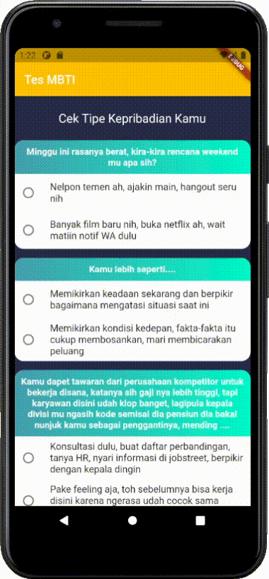

# simple_mbti

#### Aplikasi ini adalah aplikasi analisis kepribadian sederhana yang dirancang dengan metode MBTI

>MBTI adalah singkatan dari Myers-Birggs Type Indicator. Tes yang dirancang untuk mengkategorikan individu berdasarkan bagaimana mereka berpikir dan bertingkah laku.   Penasaran tipe kepribadian yang mana dirimu? Yuk, ikuti tes kepribadian berikut untuk mengetahui, sebenarnya kamu masuk tipe kerpibadian apa.

# Screenshot Aplikasi

## Informasi Mahasiswa
Nama : Dionisius D. Yapenrui  
NIM : 1931710111  
Kelas : MI-2B

## Getting Started

This project is a starting point for a Flutter application.

A few resources to get you started if this is your first Flutter project:

- [Lab: Write your first Flutter app](https://flutter.dev/docs/get-started/codelab)
- [Cookbook: Useful Flutter samples](https://flutter.dev/docs/cookbook)

For help getting started with Flutter, view our
[online documentation](https://flutter.dev/docs), which offers tutorials,
samples, guidance on mobile development, and a full API reference.
